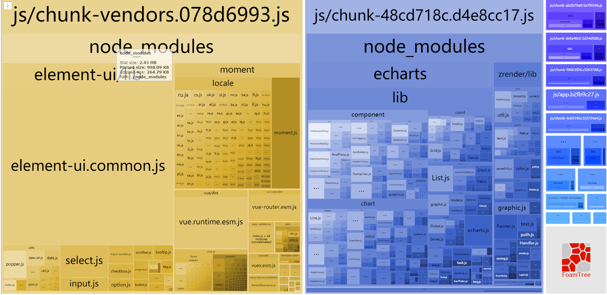

# VUE项目相关优化
## 三方组件库的按需加载
  > 使用element-ui、iview等公共组件库都可以使用按需加载只加载用到的组件而不必全部加载

## 删除build后的.map文件
  一般build后的文件是直接给线上用的，无需使用.map进行开发调试，在开发阶段调试问题。
  1. webpack config
```js
  productionSourceMap: false
```

  2. vue-cli3 项目根目录 vue.config.js
```js
module.exports = {
  productionSourceMap: false
}
```

## vue-router路由懒加载
  使用路由懒加载的话不会将所有vue路由的页面打包至一个js，而是以路由的文件为小入口划分打包的js，从而让浏览器“按需加载”；等访问某个页面时在下载相关js，从而加快首屏加载速度

> 代码参考vue-router文档

## vendor.js体积优化
  > 使用webpack插件webpack-bundle-analyzer进行分析build后各文件体积构成，以得出需要优化的点
  ### webpack-bundle-analyzer配置
  1.webpack
  ```js
    if (config.build.bundleAnalyzerRepor) {
      const BundleAnalyzerPlugin = require('webpack-bundle-analyzer').BundleAnalyzerPlugin
      webpackConfig.plugins.push(new BundleAnalyzerPlugin())
    }
  ```
  2.vue.config.js
  ```js
    module.exports = {
      chainWebpack: config => {
        config
          .plugin('webpack-bundle-analyzer')
          .use(require('webpack-bundle-analyzer').BundleAnalyzerPlugin)
      }
    }
  ```

例：


由此得出主要是由于引入的三方库 element-ui、moment、echarts占体积较大，导致初始化首屏加载js体积过大加载慢

优化方案：

1. 确定引入的必要性：尽可能减少三方库的使用，尽量避免只是轻度使用而带来的“大麻烦”

2. 将三方库使用CDN链接引入配合webpack设置externals使用三方库
  > 有效缩小vendor.js文件体积，并正常使用commonjs、AMD/CMD、ES6module引入或window对象使用
  ```js
  // key为模块化的名字,value为script引入库在window对象的属性名
  config.externals = {
    'vue': 'Vue',
    'echarts': 'echarts',
    'v-charts': 'VeChart',
    'element-ui': 'ELEMENT'
  }
  ```
3. http压缩
   > web服务器启用gzip压缩返回请求资源
